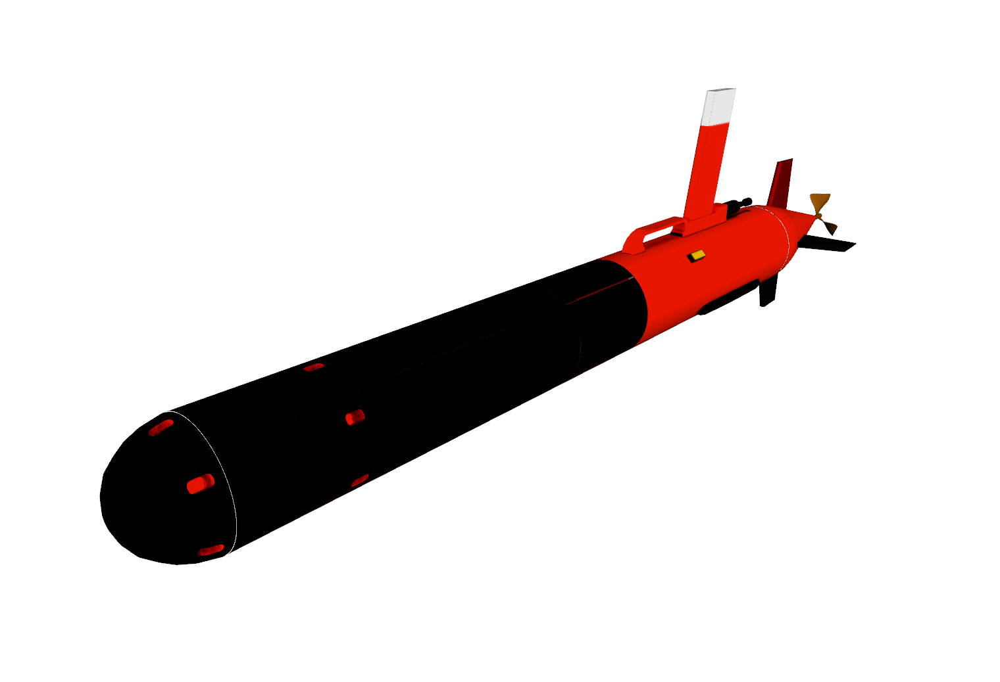

# Light Autonomous Underwater Vehicle (LAUV) model for Gazebo

[](https://travis-ci.org/uuvsimulator/lauv_gazebo)
[](https://github.com/uuvsimulator/lauv_gazebo/issues)


> Link to the `lauv_gazebo` repository [here](https://github.com/uuvsimulator/lauv_gazebo)

> Link to the [documentation page](https://uuvsimulator.github.io/packages/lauv_gazebo/intro/)

> Chat on [Discord](https://discord.gg/zNauF2F)

This repository contains the robot description and necessary launch files to
simulate the [Light Autonomous Underwater Vehicle (LAUV)](http://www.oceanscan-mst.com/), developed by the [Laboratório de Sistemas e Tecnologia Subaquática (LSTS) from Porto University](https://www.lsts.pt/) and [OceanScan-MST](http://www.oceanscan-mst.com/).
This repository is complementary to the [Unmanned Underwater Vehicle Simulator (UUV Simulator)](https://github.com/uuvsimulator/uuv_simulator),
an open-source project extending the simulation capabilities of the robotics
simulator Gazebo to underwater vehicles and environments. For installation and
usage instructions, please refer to the [documentation pages](https://uuvsimulator.github.io/).
The information about the vehicle dynamic model and physical dimensions were retrieved from the following
sources:

* [Sousa, Alexandre, et al. "LAUV: The man-portable autonomous underwater vehicle." IFAC Proceedings Volumes 45.5 (2012): 268-274.](https://www.sciencedirect.com/science/article/pii/S1474667016306140)
* [da Silva, Jorge Estrela, et al. "Modeling and simulation of the LAUV autonomous underwater vehicle." 13th IEEE IFAC International Conference on Methods and Models in Automation and Robotics. Szczecin, Poland Szczecin, Poland, 2007.](http://ave.dee.isep.ipp.pt/~jes/english/publications/mmar07.pdf)



## Purpose of the project

This software is a research prototype, originally developed for the EU ECSEL
Project 662107 [SWARMs](http://swarms.eu/).

The software is not ready for production use. However, the license conditions of the
applicable Open Source licenses allow you to adapt the software to your needs.
Before using it in a safety relevant setting, make sure that the software
fulfills your requirements and adjust it according to any applicable safety
standards (e.g. ISO 26262).

## Requirements

To simulate the Light Autonomous Underwater Vehicle (LAUV), please refer to the [UUV Simulator](https://github.com/uuvsimulator/uuv_simulator)
repository and follow the installation instructions of the package. Then you can clone
this package in the `src` folder of you catkin workspace

```
cd ~/catkin_ws/src
git clone https://github.com/uuvsimulator/lauv_gazebo.git
```

and then build your catkin workspace

```bash
cd ~/catkin_ws
catkin_make # or <catkin build>, if you are using catkin_tools
```

## Configuration of the Gazebo world

The simulation with the fin plugins have shown better results by configuring
the Gazebo's `.world` file with the following parameters for the physics engine:

```xml
<physics name="default_physics" default="true" type="ode">
  <max_step_size>0.01</max_step_size>
  <real_time_factor>1</real_time_factor>
  <real_time_update_rate>100</real_time_update_rate>
  <ode>
    <solver>
      <type>quick</type>
      <iters>50</iters>
      <sor>1.2</sor>
    </solver>
  </ode>
</physics>
```

Check the [Mangalia world file](https://github.com/uuvsimulator/uuv_simulator/blob/master/uuv_gazebo_worlds/worlds/mangalia.world) to see an example.

## License

LAUV Gazebo package is open-sourced under the Apache-2.0 license. See the
[LICENSE](https://github.com/uuvsimulator/lauv_gazebo/blob/master/LICENSE) file for details.
